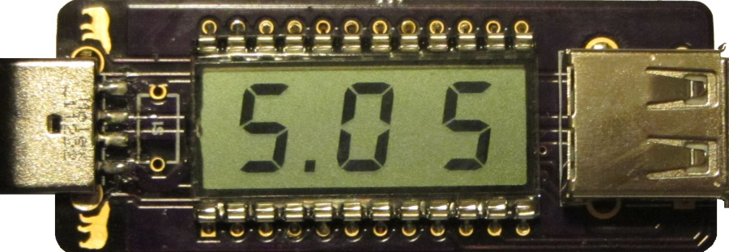

### UsbAmps (revision A) ###

UsbAmps is a small USB pass-through device that measures current, voltage and
power used by whatever is connected on its output.

By default it shows current value but you can also recall minimum and maximum.

#### Usage ####

Two bears are actually touch-sensitive buttons. Upper button determines what
are you measuring (current, voltage, or power) and lower button determines
whether you will see current value or minimum/maximum.

* Button 1: Current (A) / Voltage (V) / Power (W)
* Button 2: Actual / Maximum / Minimum
* Button 1&2: Resets minimum/maximum.

This release also has an (unused) place for physical switch.

#### Specifications ####

|         | Input ratings   |
|---------|-----------------|
| Voltage | 5 ±10% V        |
| Current | 10 mA (typical) |

|         | Output ratings             |
|---------|----------------------------|
| Current | 2 A (maximum, not limited) |

##### ADC resolution #####

10-bit ADC enables 1024 distinct measurement steps. Since 4.096 V is used as
voltage reference this brings us to resolution of 4.1 mA/mV.

Since device averages multiple measurements you can also expect values
in-between.

##### Display resolution #####

Display will show resolution of 1 mA up to 100 mA. All other measurements are
shown with resolution of 10 mA/mV/mW (e.g. 5.10 V).

##### Accuracy #####

| Range          | Resolution | Accuracy |
|:--------------:|:----------:|:--------:|
| 0 - 99 mA      | 1 mA       | 1% + 12  |
| 0.10 - 2.00 A  | 0.01 A     | 1% + 8   |
| 5.00 ±10% V    | 0.01 V     | 1% + 1   |

Accuracy is given as ±(percent of reading + [counts](http://www.youtube.com/watch?v=U4JFeU-o2kc)
of least significant digit).

Due to averaging, it will usually do better than this, but don't count on it as
a precision device.
